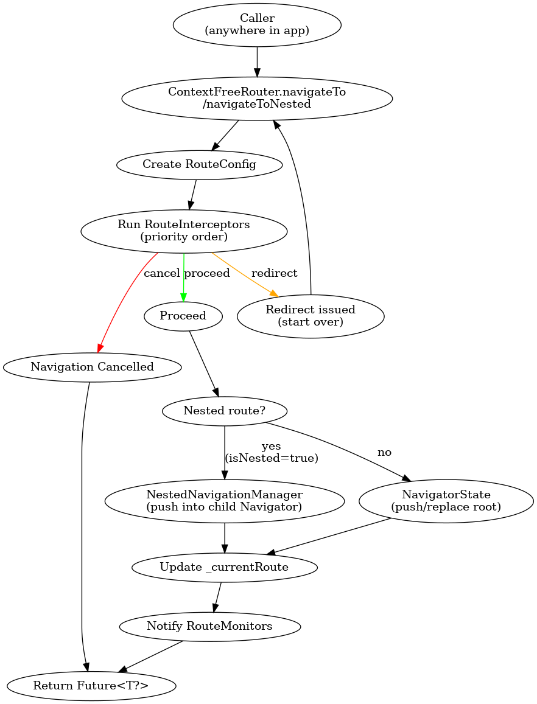
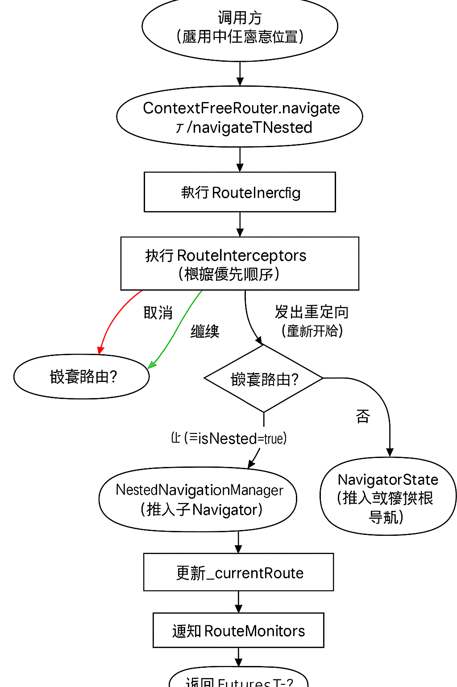

# README.md

> **Context-Free Router** — 一款不依赖 `BuildContext` 的 Flutter 路由插件
> 零侵入 · 可拦截 · 可监控 · 原生支持多级嵌套导航

---

## ✨ 特性

* **Context-Free 调用**
  全局单例 `ContextFreeRouter.instance`，任何位置都能安全导航
* **多级嵌套导航**
  同一 `Navigator` 可容纳多个子栈（典型场景：Tab 内部再 Push）
* **可插拔拦截链**
  登录校验、权限校验、AB 实验等通过实现 `RouteInterceptor` 即可接入，按 `priority` 顺序执行
* **全局路由监控**
  监听跳转、取消、重定向、异常等事件，方便统计或埋点
* **灵活的参数与返回值**
  支持 `Map<String, dynamic>` 参数、`extra` 任意对象以及范型化的结果返回
* **自定义转场**
  通过 `NestedRouteTransition` 轻松定义子栈专属动画
* **零学习成本**
  API 与原生 Navigator 类似，易于迁移

---

## 📦 安装

在 `pubspec.yaml` 中添加依赖（示例为 Git 路径，发布到 pub.dev 后改为版本号即可）：

```yaml
dependencies:
  context_free_router:
    git:
      url: https://github.com/your-org/context_free_router
```

---

## 🚀 快速开始

### 1️⃣ 初始化

```dart
final router = ContextFreeRouter.instance;

MaterialApp(
  navigatorKey: router.navigatorKey,   // 一定要注入
  home: const HomePage(),
);
```

### 2️⃣ 注册页面

```dart
router.register('/',       (_) => const HomePage());
router.register('/login',  (_) => const LoginPage());

// 嵌套路由：/tab/first, /tab/second…
router.register('/tab',    (_) => const TabRootPage());
router.registerNested('/tab', 'first',  (_) => const FirstTabPage());
router.registerNested('/tab', 'second', (_) => const SecondTabPage());
```

### 3️⃣ 跳转与返回

```dart
// 普通跳转
router.navigateTo('/login');

// 携带参数
router.navigateTo('/profile', params: {'id': 42});

// 嵌套跳转（先进入父级 /tab，再进入子页）
await router.navigateTo('/tab');
router.navigateToNested('/tab', 'first');

// 返回
if (router.canGoBack()) router.goBack();
```

### 4️⃣ 拦截器

```dart
router.addInterceptor(
  AuthInterceptor(
    protectedRoutes: ['/profile', '/settings'],
    loginRoute: '/login',
    isAuthenticatedCallback: () async => AuthService.instance.isLoggedIn,
  ),
);

router.addInterceptor(
  PermissionInterceptor(
    routePermissions: {
      '/admin': ['can_view_admin'],
    },
    unauthorizedRoute: '/403',
    checkPermissionsCallback: PermissionService.check,
  ),
);
```

拦截器越“重要”`priority` 越高，会先执行。

### 5️⃣ 监控器

```dart
router.addMonitor(
  AnalyticsMonitor(
    trackEvent: (event, props) => Analytics.log(event, props),
  ),
);
```

### 6️⃣ 自定义子栈动画（可选）

```dart
final slide = NestedRouteTransition(
  parentPath: '/tab',
  childPath: 'first',
  transitionBuilder: (ctx, animation, _, child) {
    final offset = Tween(begin: const Offset(1, 0), end: Offset.zero)
        .animate(animation);
    return SlideTransition(position: offset, child: child);
  },
);

// 在创建 MaterialPageRoute 之前调用 slide.createRoute(child, settings)
```

---
## 📑 路由执行流程

> 下图展示了从调用 `navigateTo / navigateToNested` 到最终返回的完整执行链：拦截器 → 嵌套/根导航 → 监听器。




## 🗂️ API 速查

| 类 / 方法                          | 作用                                 |
| ------------------------------- | ---------------------------------- |
| `ContextFreeRouter.instance`    | 路由单例                               |
| `navigatorKey` / `currentRoute` | 全局 NavigatorKey / 当前路由             |
| `register / registerNested`     | 注册根路由 / 子路由                        |
| `navigateTo / navigateToNested` | 跳转根路由 / 子路由                        |
| `goBack / canGoBack`            | 返回 / 是否可返回                         |
| `RouteInterceptor`              | 自定义拦截器基类                           |
| `RouteMonitor`                  | 路由监控基类                             |
| `AuthInterceptor`               | 登录拦截示例                             |
| `PermissionInterceptor`         | 权限拦截示例                             |
| `AnalyticsMonitor`              | 埋点监控示例                             |
| `RouteConfig`                   | 路由配置对象（包含 path / params / extra 等） |

---

## 🛠 示例项目

仓库内 `example/` 目录提供了完整 Demo，涵盖：

* Tab + 嵌套导航
* 登录与权限拦截
* 自定义动画
* 事件埋点

运行：

```bash
cd example
flutter run
```

---

## 🤝 贡献指南

1. Fork 本仓库并创建分支
2. 提交 PR 前请运行 `flutter test` & `dart format .`
3. 描述清楚问题和解决方案

---

## 📄 License

MIT © 2025 Chihiro

---